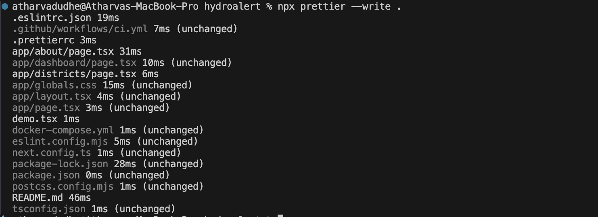
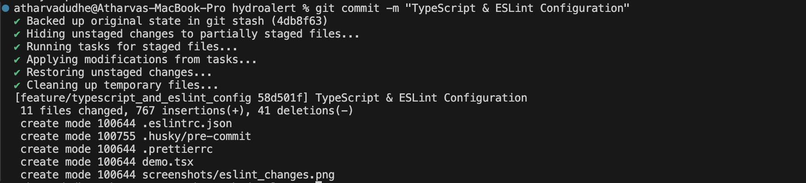
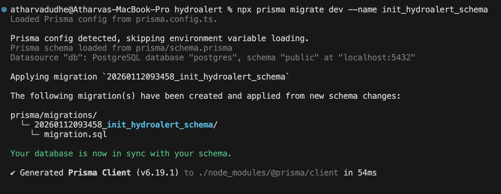
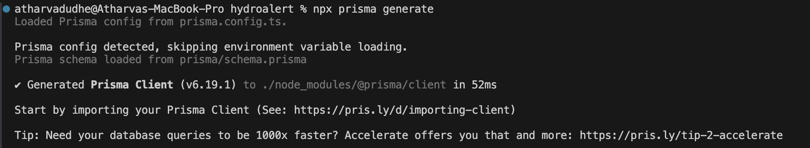
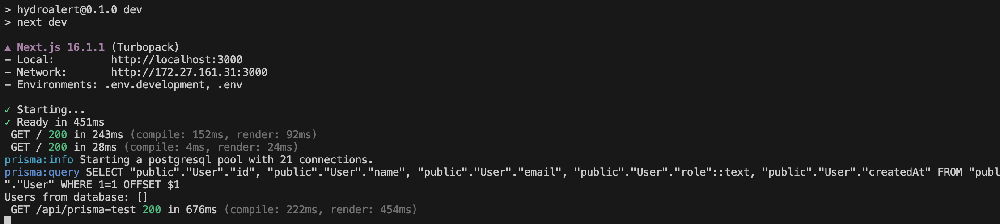
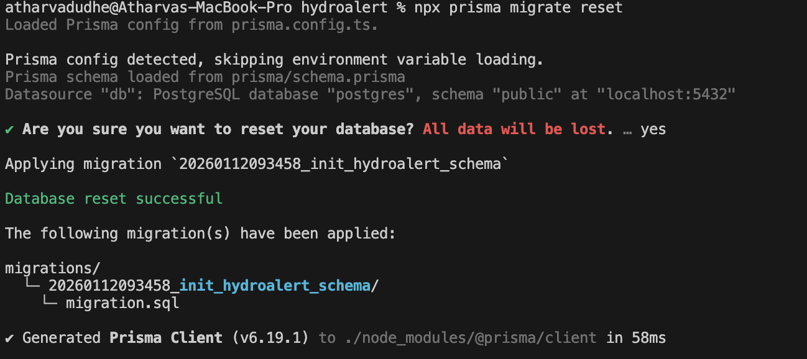
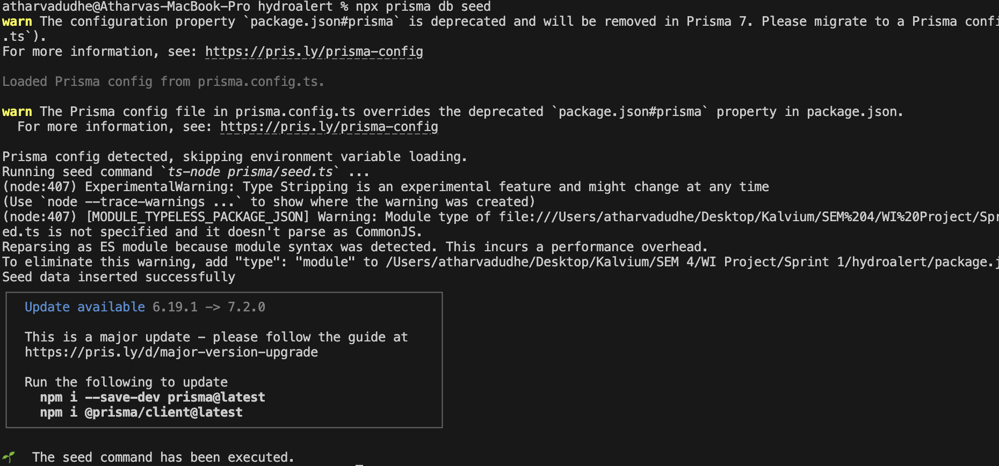
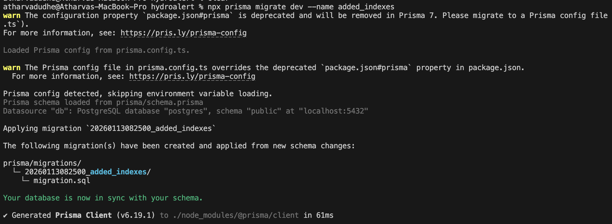
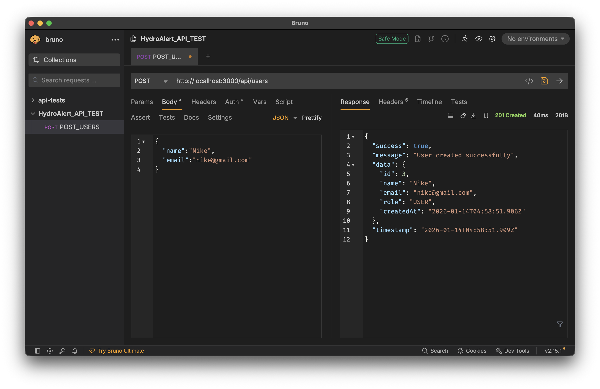
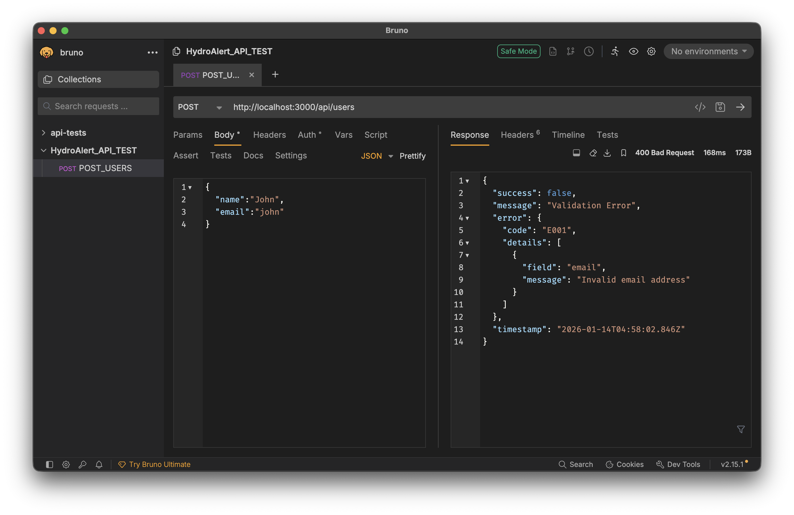

# Rendering Strategies in FloodGuard (SSG, SSR, ISR)

This project demonstrates how **Static Site Generation (SSG)**,  
**Server-Side Rendering (SSR)**, and **Hybrid Rendering using Incremental Static Regeneration (ISR)** can be combined effectively in a real-world Next.js application.

The goal is to balance **performance**, **data freshness**, and **scalability** based on the nature of each page and its data requirements.

---

## How Rendering Choices Affect Performance, Scalability, and Data Freshness

In a Next.js application, rendering strategy directly impacts:

- **Performance** → how fast pages load (TTFB)
- **Scalability** → how well the app handles traffic
- **Data Freshness** → how up-to-date the content is

Each rendering mode optimizes different parts of this triangle.

### Static Site Generation (SSG)

- **Performance:** Excellent (served as pre-built HTML)
- **Scalability:** Excellent (no server computation per request)
- **Data Freshness:** Low (data updates only on rebuild)

### Server-Side Rendering (SSR)

- **Performance:** Moderate (server renders on every request)
- **Scalability:** Lower (high server load at scale)
- **Data Freshness:** Excellent (always up-to-date)

### Hybrid Rendering (ISR)

- **Performance:** Very good
- **Scalability:** Very good
- **Data Freshness:** Good (time-based updates)

ISR acts as a middle ground between SSG and SSR.

---

## Rendering Strategies Used in FloodGuard

FloodGuard uses all three rendering modes based on real-world needs.

### Static Rendering (SSG) — `/about`

- Used for project information that rarely changes
- Implemented using:
  ```ts
  export const revalidate = false;
  ```
- Benefits:
  - Instant page load
  - Zero runtime cost
  - Ideal for informational or marketing content

### Server-Side Rendering (SSR) — `/dashboard`

- Used for live weather and flood data
- Implemented using:

  ```tsx
  export const dynamic = "force-dynamic";
  fetch(url, { cache: "no-store" });
  ```

- Benefits:
  - Always fresh data
  - Accurate real-time alerts

- Trade-off:
  - Higher server cost
  - Slower than static pages

### Hybrid Rendering (ISR) — /districts

- Used for district-level flood risk data
- Implemented using:
  ```tsx
  export const revalidate = 60;
  ```
- Benefits:
  - Near-static performance
  - Periodic data freshness
  - Much better scalability than SSR

## Case Study: “The News Portal That Felt Outdated”

### Scenario Overview

At **DailyEdge**, a news and media startup, the homepage was implemented using **Static Site Generation (SSG)**.  
This made the page extremely fast to load, but users began reporting that the **“Breaking News”** section often displayed headlines that were hours old.

To fix this, the engineering team switched the entire homepage to **Server-Side Rendering (SSR)**.  
While this solved the freshness problem, it introduced new issues:

- Slower page load times
- Increased server usage
- Higher hosting costs due to rendering on every request

This scenario highlights the core challenge in modern web applications:  
**balancing speed, data freshness, and scalability**.

---

### Trade-off Analysis

Each rendering strategy optimizes different aspects of the system.

| Rendering Mode | Speed        | Data Freshness | Scalability  |
| -------------- | ------------ | -------------- | ------------ |
| Static (SSG)   | ✅ Excellent | ❌ Poor        | ✅ Excellent |
| Dynamic (SSR)  | ❌ Slower    | ✅ Excellent   | ❌ Poor      |
| Hybrid (ISR)   | ✅ Good      | ✅ Good        | ✅ Good      |

Using a single rendering strategy for all pages leads to inefficiencies and poor user experience.

---

## Environment-Aware Configuration & Secrets Management

This project supports multiple deployment environments:

- Development
- Staging
- Production

### Environment Configuration

Each environment uses its own `.env` file:

- `.env.development`
- `.env.staging`
- `.env.production`

Only `.env.example` is committed to the repository to prevent
accidental exposure of sensitive data.

### Secure Secrets Management

Sensitive values such as API keys are stored using GitHub Secrets
and injected during build or deployment time.

No secrets are hardcoded or committed to the repository.

### Why Multi-Environment Setups Matter

Using separate environments allows safer testing, prevents
production outages, and ensures consistent behavior across CI/CD
pipelines.

---

## Understanding Cloud Deployments: Docker → CI/CD → AWS/Azure

This project explores how a full-stack application can be taken from
local development to the cloud using containerization and automation.

---

### Docker: Containerizing the Application

The application is containerized using Docker to ensure consistency
across development, staging, and production environments.

A Dockerfile is used to:

- Install dependencies
- Build the Next.js application
- Run the app inside a container

This makes the application portable and cloud-ready.

---

### CI/CD: Automating Builds with GitHub Actions

A GitHub Actions pipeline is configured to automatically:

- Install dependencies
- Build the application
- Fail early if issues are detected

This ensures that every code change is validated before deployment,
improving reliability and developer confidence.

---

### Cloud Deployment Strategy (AWS / Azure)

In a production setup:

- The Docker image would be pushed to a container registry (ECR / ACR)
- The app would be deployed using ECS, Elastic Beanstalk, or Azure App Service
- Environment variables and secrets would be injected securely at runtime

This separation allows safe and repeatable deployments across environments.

---

### Security & Configuration

- Secrets are never committed to the repository
- Environment variables are managed via GitHub Secrets or cloud key stores
- Different environments (dev, staging, prod) use separate configurations

---

### Reflection

The most challenging part was understanding how all the pieces
(Docker, CI/CD, and cloud services) fit together.

The most valuable learning was realizing how automation reduces
deployment errors and improves consistency.

In future deployments, adding automated testing and full CD
pipelines would further improve reliability.

---

## Project Initialization & Folder Structure

### Project Setup

This project was initialized using **Next.js with TypeScript** to ensure type safety, scalability, and alignment with modern production standards.

Command used:

```bash
npx create-next-app@latest HyderoAlert --typescript
```

After initialization, the application was successfully run locally and verified at:

```bash
http://localhost:3000
```

This confirmed that the project setup was correct and ready for further development.

## Folder Structure Overview

The project follows a clean and modular folder structure designed to support
scalability, readability, and long-term maintainability.

```txt
src/
├── app/          # Routes, layouts, and pages (Next.js App Router)
├── components/   # Reusable UI components
├── lib/          # Utilities, helpers, and configuration logic
```

## Folder Purpose & Responsibilities

### `app/`

- Contains all application routes, layouts, and pages using the **Next.js App Router**
- Each folder inside `app/` maps directly to a route in the application
- Handles page-level rendering logic, including Static (SSG), Dynamic (SSR), and Hybrid (ISR) rendering
- Keeps routing and layout concerns centralized and easy to reason about

### `components/`

- Stores reusable UI components such as buttons, cards, badges, modals, and layout blocks
- Helps keep page files clean by separating presentation logic from routing logic
- Encourages consistency in UI design across the application
- Makes components easy to reuse and test independently

### `lib/`

- Contains shared utilities, helper functions, and configuration files
- Central location for non-UI logic such as API helpers, constants, formatting functions, and shared logic
- Prevents duplication of logic across multiple pages or components
- Improves maintainability by keeping business logic decoupled from UI

---

## Naming Conventions

To maintain clarity and consistency across the codebase, the following naming
conventions are followed:

- **Folders:** lowercase and descriptive (`dashboard`, `districts`)
- **Components:** PascalCase (`AlertCard.tsx`, `RiskBadge.tsx`)
- **Utility files:** camelCase (`fetchWeather.ts`, `calculateRisk.ts`)
- **Environment variables:** UPPERCASE with clear prefixes (`NEXT_PUBLIC_*`)

These conventions improve readability and make collaboration easier in team
environments.

---

## Scalability & Maintainability Benefits

This folder structure supports scalability by:

- Clearly separating routing, UI, and business logic responsibilities
- Making it easier to add new features without impacting existing ones
- Allowing developers to quickly locate relevant code
- Aligning with industry-standard Next.js project organization practices

As the project grows to include authentication, databases, cloud services,
and CI/CD pipelines, this structure ensures the codebase remains organized
and manageable.

---

## Local Development Verification

The application was run locally using:

```bash
npm run dev
```

The development server started successfully, and the application was accessible at:

```bash
http://localhost:3000
```

This confirms that the project initialization and folder structure are correctly
set up and ready for further development.

---

# Code Quality & Consistency Setup

This project uses **strict TypeScript settings**, **ESLint**, **Prettier**, and **pre-commit hooks** to ensure clean, consistent, and reliable code throughout development. These tools help catch bugs early, enforce coding standards, and maintain team-wide consistency.

---

## 1. Strict TypeScript Configuration

We enabled strict TypeScript rules in `tsconfig.json` to catch potential issues at compile time instead of runtime.

### Enabled Options

```json
{
  "strict": true,
  "noImplicitAny": true,
  "noUnusedLocals": true,
  "noUnusedParameters": true,
  "forceConsistentCasingInFileNames": true,
  "skipLibCheck": true
}
```

### Why This Matters

- Prevents the use of implicit `any` types
- Detects unused variables and parameters
- Avoids file name casing issues across different operating systems
- Reduces runtime bugs by enforcing type safety early

## 2. ESLint & Prettier Setup

We use ESLint for code quality rules and Prettier for consistent formatting.

### ESLint Configuration

ESLint is configured using Next.js core rules and integrated with Prettier:

```json
{
  "extends": ["next/core-web-vitals", "plugin:prettier/recommended"],
  "rules": {
    "no-console": "warn",
    "semi": ["error", "always"],
    "quotes": ["error", "double"]
  }
}
```

### Prettier Configuration

```json
{
  "singleQuote": false,
  "semi": true,
  "tabWidth": 2,
  "trailingComma": "es5"
}
```

### What These Rules Enforce

- Consistent use of double quotes
- Mandatory semicolons
- Clean formatting with uniform spacing
- Warnings for unnecessary `console.log` statements

## 3. Pre-Commit Hooks (Husky + lint-staged)

To prevent linting and formatting issues from entering the repository, we use Husky and lint-staged.

### How It Works

- Husky runs a pre-commit hook before every commit
- lint-staged runs ESLint and Prettier only on staged files
- Commits are blocked until all issues are fixed

### lint-staged Configuration

```json
"lint-staged": {
  "*.{ts,tsx,js,jsx}": [
    "eslint --fix",
    "prettier --write"
  ]
}
```

## 4. Validation & Testing

To verify the setup:

- Code with lint or formatting errors was committed intentionally
- The commit failed due to ESLint/Prettier violations
- Errors were fixed automatically or manually
- The commit succeeded after corrections
  This confirms that code quality checks are enforced before changes are committed.

## Benefits of This Setup

- Catches bugs early during development
- Enforces consistent code style across the team
- Prevents broken or poorly formatted code from being committed

## Screenshots

The following screenshots demonstrate successful ESLint, Prettier, and pre-commit hook execution.

### Successful Pre-Commit Hook & Lint-Staged Execution
This screenshot shows a successful Git commit where Husky executed lint-staged and applied ESLint and Prettier checks before completing the commit.



### Successful Prettier Formatting
This screenshot shows Prettier running across the project and confirming consistent formatting with no remaining violations.



---

## 🔐 Environment Variable Management

This project follows best practices for managing environment variables to ensure security, scalability, and safe separation between server-side and client-side configuration.

---

### Environment Files

The project uses the following environment files:

- **`.env.local`**
  - Stores actual credentials and sensitive values
  - Used for local development and runtime configuration
  - Never committed to version control

- **`.env.example`**
  - Serves as a template for all required environment variables
  - Contains placeholder values and comments explaining usage
  - Committed to the repository to support easy project setup

---

### Variable Scope & Access Rules

Next.js enforces strict environment variable scoping:

- **Server-side variables**
  - Do **not** use the `NEXT_PUBLIC_` prefix
  - Accessible only in server components, API routes, and backend logic
  - Example:
    ```ts
    const dbUrl = process.env.DATABASE_URL;
    ```

- **Client-side variables**
  - Must start with `NEXT_PUBLIC_`
  - Safe to use inside client components
  - Example:
    ```ts
    const apiUrl = process.env.NEXT_PUBLIC_API_BASE_URL;
    ```

Server-only secrets are never referenced in client-side code.

---

### Secret Protection & Git Safety

To prevent accidental exposure of sensitive data:

- `.env.local` is excluded via `.gitignore`
- Only `.env.example` is tracked in version control

**Git ignore configuration:**
```gitignore
.env*
!.env.example
```

---

## GitHub Workflow & Collaboration Standards

This project follows a professional GitHub workflow to ensure code quality, consistency, and effective team collaboration.

---

### Branch Naming Convention

All branches must follow this naming format:

- `feature/<feature-name>` – for new features
- `fix/<bug-name>` – for bug fixes
- `chore/<task-name>` – for maintenance or setup tasks
- `docs/<update-name>` – for documentation updates

**Examples:**
```
feature/user-auth
fix/navbar-spacing
docs/update-readme
```

---

### Pull Request Template

All pull requests automatically use a standardized PR template that includes:
- Summary of changes
- List of updates made
- Screenshots or evidence (if applicable)
- A checklist for build, lint, review, and issue linkage

This ensures PRs are easy to review and maintain consistent quality.

---

### Code Review Checklist

Every pull request is reviewed using the following checklist:

- Code follows naming conventions and project structure
- Functionality verified locally
- No console errors or warnings
- ESLint and Prettier checks pass
- Comments and documentation are clear and meaningful
- No sensitive data (keys, secrets) is exposed

---

### Branch Protection Rules

The `main` branch is protected with the following rules:
- Pull request reviews are required before merging
- Status checks must pass before merging
- Direct pushes to `main` are disabled
- Branch must be up to date before merge

These rules ensure all changes are reviewed and validated before entering the main codebase.

---

# 🐳 Dockerizing a Next.js Application
## 📌 What I Did in This Assignment

In this assignment, I containerized a Next.js application using Docker to understand how modern applications are packaged and run in a consistent environment.

### I started by creating a Dockerfile where I:
- Used an official Node.js Alpine image
- Set a working directory inside the container
- Installed project dependencies
- Built the application in production mode
- Exposed port 3000 and started the app using npm start
- This Dockerfile defines how the application is built and executed inside a container.

### 🧩 Docker Compose Setup

Next, I created a docker-compose.yml file to simplify running the container.

#### Using Docker Compose, I:
- Built the image from the Dockerfile
- Mapped port 3000 from the container to the host
- Loaded environment variables using an .env.development file
- This allowed me to run the entire setup using a single command.

#### ▶️ Running the Application

I started the container using:
```json
docker-compose up --build
```

After the build completed:
- The application was accessible at http://localhost:3000
- I verified the running container using docker ps

### Successful Docker Execution

This screenshot shows the successful execution of the Docker Compose setup.
The logs confirm that the Next.js application container was built correctly, started without errors, and is running on the exposed port.


---

## Database Schema Design (PostgreSQL)

This project uses a **normalized PostgreSQL relational schema** designed to
support scalability, consistency, and efficient querying for flood monitoring
and alerting.

### Core Entities
- **User** – represents residents or authorities using the system
- **District** – flood-prone geographic regions
- **WeatherReading** – raw meteorological data per district
- **FloodRisk** – computed risk level for each district
- **Alert** – notifications sent to users


### Keys & Relationships
- Primary keys ensure unique identification of each record
- Foreign keys enforce referential integrity between entities
- Cascading deletes maintain data consistency
- Indexes optimize time-based and district-based queries


### Normalization Notes
- **1NF:** All fields are atomic (no repeating groups)
- **2NF:** Non-key attributes depend fully on primary keys
- **3NF:** No transitive dependencies; derived data stored separately

This avoids redundancy and improves maintainability.

### Scalability Considerations
- Time-series data stored separately (`WeatherReading`)
- Risk computation decoupled from raw data
- Indexed foreign keys support fast lookups
- Schema supports future extensions (prediction models, alerts, RBAC)

### Migration & Verification
- Database schema created using Prisma migrations
- Tables verified using Prisma Studio
- Seed data inserted successfully for testing

### Common Queries Supported
- Latest flood risk per district
- Weather trends over time
- Alerts sent to a specific user
- High-risk districts in the last 24 hours

### ER Diagram (Textual Representation)
```sql
User
 ├── id (PK)
 ├── email (UNIQUE)
 └── role
     |
     | 1-to-many
     ↓
Alert
 ├── id (PK)
 ├── userId (FK)
 ├── districtId (FK)
 └── message

District
 ├── id (PK)
 ├── name (UNIQUE)
 ├── latitude
 └── longitude
     |
     | 1-to-many
     ↓
WeatherReading
 ├── id (PK)
 ├── districtId (FK)
 ├── rainfallMm
 └── recordedAt

District
     |
     | 1-to-many
     ↓
FloodRisk
 ├── id (PK)
 ├── level
 └── predictedAt
```

### Successful Database Migration

This screenshot shows the successful execution of the Prisma migration process.
The logs confirm that the PostgreSQL database was reachable, the schema was
validated correctly, and the initial migration was applied without errors.

This verifies that the relational schema is valid and that all tables were
successfully created in the database.



---

## Prisma ORM Setup & Client Verification

In this assignment, Prisma ORM was integrated into the project to establish
a type-safe and reliable connection between the Next.js application and the
PostgreSQL database.

---

### What Was Implemented

- Installed and initialized **Prisma ORM** in the project
- Defined the database schema using `schema.prisma`
- Generated the **Prisma Client** for type-safe database access
- Created a reusable Prisma client singleton for the application
- Verified database connectivity by executing a real query using Prisma Client

---

### Prisma Client Generation

The Prisma Client was successfully generated based on the defined schema,
confirming that the models and configuration are valid.



---

### Database Connection & Query Verification

A temporary server-side API route was used to execute a test query:

```ts
const users = await prisma.user.findMany();
```
The query executed successfully, returning results from the database and
logging the generated SQL query, confirming that Prisma Client is properly
connected to PostgreSQL.

### Outcome
- Prisma Client is correctly generated and initialized
- The application can successfully communicate with the PostgreSQL database
- Database queries execute without errors
- The project is now ready for database-driven features such as APIs,
authentication, and data persistence

This setup forms the foundation for all future backend and database operations
in the project.



---

## Database Migrations & Seeding (Prisma)

We focuses on creating reproducible database migrations and
seed scripts using Prisma ORM to ensure consistent database structure and
initial data across environments.

### Migrations Workflow
- Prisma migrations are used to version and apply schema changes
- The initial schema was migrated using:
  ```bash
  npx prisma migrate dev --name init_hydroalert_schema
  ```
- Migrations are stored inside `prisma/migrations/`
- Schema resets and rollbacks can be performed safely using:
  ```bash
  npx prisma migrate reset
  ```

### Seed Script
A seed script was added to insert consistent initial data into the database.
- File: `prisma/seed.ts`
- Uses idempotent operations (`upsert`) to prevent duplication
- Inserts sample users, districts, weather readings, and flood risk data
Seed command:
```bash
npx prisma db seed
```

### Verification
- Migrations were applied successfully
- Seed data was inserted without errors
- Data was verified using Prisma Studio

### Reflection
Using versioned migrations ensures schema consistency across teams and
environments. Seed scripts provide predictable starting data for development
and testing.

### Screenshots
#### **Prisma Database Reset**


#### **Seed Command Success**


---

## Transactions, Indexing & Query Optimization (Prisma)

This assignment focuses on maintaining data integrity using database
transactions and improving performance through indexing and optimized
queries.

### Transaction Usage
Transactions were implemented to ensure multiple dependent database
operations either succeed together or fail together.

**Scenario:**  
When a flood risk is detected, a flood risk record and a user alert are
created within a single transaction.

If any operation fails, Prisma automatically rolls back the entire
transaction.

### Rollback Handling
Transactions are wrapped in try-catch blocks to handle errors gracefully.
Rollback behavior was verified by intentionally triggering an error and
confirming that no partial data was written.

### Indexes for Performance
Indexes were added to frequently queried fields to improve lookup speed.

```prisma
@@index([userId])
@@index([districtId])
```



### Query Optimization
Queries were optimized by:
- Selecting only required fields
- Avoiding unnecessary relations
- Reducing over-fetching

Prisma query logs were used to compare execution before and after
optimization.

### Reflection

Transactions protect data integrity when operations depend on each other,
while indexes and optimized queries significantly improve performance as
data grows.

---

## RESTful API Design & Routing

This assignment focuses on designing and organizing RESTful API routes
using Next.js App Router and file-based routing.

### API Route Hierarchy
The backend APIs are structured by resource using predictable and
consistent naming conventions:

- `/api/users`
- `/api/users/[id]`
- `/api/districts`
- `/api/alerts`

Each resource supports appropriate HTTP verbs for CRUD operations.


### HTTP Verbs & Actions
- GET → Fetch resources
- POST → Create new records
- DELETE → Remove records

Pagination is implemented on list endpoints using `page` and `limit`
query parameters.

### Error Handling
Meaningful HTTP status codes are returned:
- `400` for invalid input
- `404` for missing resources
- `201` for successful creation

### API Testing
Endpoints were tested using curl to verify:
- Correct routing
- Proper JSON responses
- Pagination and error handling

### Reflection
Consistent route naming and predictable behavior make APIs easier to
understand, integrate, and maintain. A well-structured API reduces bugs
and improves team collaboration as the project grows.

---

# Global API Response Handler

We enforced a centralized API response handler to ensure
all backend endpoints return responses in a consistent, predictable format.

A unified response structure improves developer experience, simplifies
frontend integration, and enhances observability in production systems.

---

### Unified Response Format

All API responses follow a standard envelope:

```json
{
  "success": true,
  "message": "Operation completed successfully",
  "data": {},
  "timestamp": "2026-01-14T10:30:00Z"
}
```

For error cases:

```json
{
  "success": false,
  "message": "Missing required field: name",
  "error": {
    "code": "E001"
  },
  "timestamp": "2026-01-14T10:30:00Z"
}
```

### Global Response Utility
A shared utility was created to handle responses across all API routes.
- File: `lib/responseHandler.ts`
- Provides `sendSuccess()` and `sendError()` helpers
- Ensures consistent structure, timestamps, and HTTP status handling


### Error Codes

Common error codes are centralized to improve traceability and debugging:
```ts
VALIDATION_ERROR → E001  
NOT_FOUND → E002  
DATABASE_FAILURE → E003  
INTERNAL_ERROR → E500
```

### Usage Across API Routes
The response handler is used across multiple endpoints such as:
- `/api/users`
- `/api/alerts`

This guarantees consistent success and error responses regardless of the
resource being accessed.

### Developer Experience & Observability
A global response handler:
- Reduces frontend conditional logic
- Makes APIs self-documenting
- Simplifies debugging with error codes and timestamps
- Enables easy integration with monitoring tools like Sentry or Postman

This approach ensures that every API endpoint “speaks” in the same format,
making the backend easier to scale and maintain.

---

# Input Validation with Zod

We introduced input validation using **Zod**, a TypeScript-first
schema validation library, to ensure all incoming API requests contain valid
and well-structured data.

### Why Validation Matters
Without validation, APIs may accept malformed or invalid data, leading to
database corruption and unpredictable application behavior. Zod ensures
invalid requests fail early and clearly.

### Zod Schema Definition
Validation schemas are defined in shared files for reuse across the backend
and frontend.

```ts
export const userSchema = z.object({
  name: z.string().min(2),
  email: z.string().email(),
});
```

### Applying Validation in API Routes

Zod validation is applied in POST and PUT API handlers before any database
operations are executed.

Invalid requests return structured validation errors with clear messages and
error codes.

### Validation Examples

**Successful Request**


**Failing Request:**


### Schema Reuse & Maintainability

Schemas are reused across routes, ensuring consistent validation rules and
type safety throughout the application. This approach improves maintainability
and reduces duplication in team-based projects.

### Reflection

By validating inputs at the API boundary, the application becomes more robust,
secure, and predictable. Zod enables clear communication with clients and
prevents invalid data from reaching the database.

---